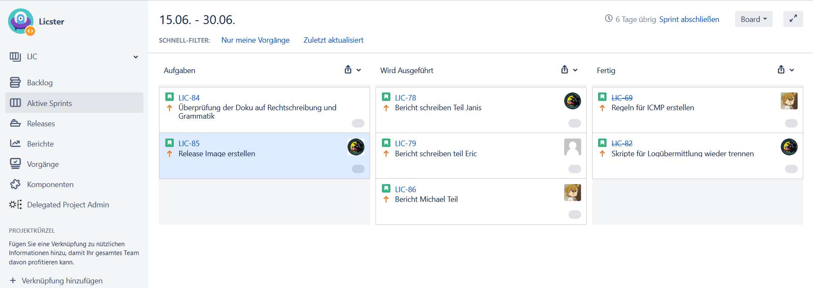

Workflow
--------

Jedes Projekt sollte damit es erfolgreich wird einen einheitlichen Workflow besitzen.
Dieser dient zur Planung, Nutzung der Ressourcen und damit das Ziel vom Projekt nicht
verfehlt wird. Zur Kommunikation im Team nützten wir verschiedene Technologien und
Vorgehensweisen, um eine möglichst gute kooperative Arbeitsweise zu ermöglichen.
Diese Strategien werden im Folgenden genauer erklärt.

Jitsi
.....
Um die Kommunikation mit dem Professor herzustellen wurde das Tool jitsi benützt.
Der Vorteil dabei liegt darin das man sich keinen Account erstellen muss.
Somit wurde es ermöglicht das jeder leicht an den Meetings teilnehmen konnte.
Das Meeting mit dem Professor war standartmäßig immer am Donnerstag um 17:30.

Discord
.......

Zur Besprechung und falls es Themen gibt, die mit dem Team besprochen werden mussten
wurde Discord benützt. Dabei wurden mehrere Text Kanäle und sprach Kanäle erstellt,
die man benutzten, kann. Bei den Text Kanälen wurde drauf geachtet das jeder punkt
einen eigenen Kanal hat. Dies haben wir getan damit eine gute Übersicht gewährleistet
wird und man somit auch bei einem späteren Zeitpunkt die Informationen leicht nachschauen
kann die man braucht.

Jira
....

Für die zentrale Verwaltung der aufgaben wurde das Tool jira benützt. Dabei wurde mit
dem Scrum Prinzip gearbeitet. In Scrum arbeitet man mit sogenannten Sprints. Diese
bestimmen einen Zeitraum, bei uns 1-2 Wochen, in der bestimmte Aufgaben erledigt
werden müssen. Die Arbeitsweise funktionierte so dass man sich am Anfang einer jeden
Woche drauf geeinigt hat welche aufgaben erledigt werden müssen diese wurden dann den
jeweiligen Personen zugewiesen. Ideen oder aufgaben die für diese Woche noch nicht zu
bearbeiten sind oder noch nicht möglich sind zu bearbeiten wurden ins Backlog gesetzt.
Die aufgaben könne dabei drei zustände einnehmen: Aufgabe, wird ausgeführt und fertig.

IDS
---

In unserer heutigen Zeit nehmen Angriffe auf industriele Systeme stetig weiter zu.
Immer wieder werden neue arten gefunden wie ein System angegriffen werden kann.
Dementsprechend gibt es auch schon sehr viele verschieden Tools die dafür da sind um
zu erkennenden wenn ein Angriff oder ein exploit auf einem System ausgeführt wird und
diesen dann auch dementsprechend zu stoppen:  Software wie Firewalls verhindern dass
nicht autorisierter Datenverkehr in das Netzwerk gelangt, Spam-Filter um unerwünschte
E-Mail-Nachrichten zu verhindern und Antiware-Tools zum Schutz von Endpunkten vor Malware.
All diese Tools werden in so gut wie jedem Unternehmen eingesetzt egal welche Branche
oder wie groß es ist. Ein weiteres wertvolles Sicherheitstool was ebenfalls eingesetzt
wird ist ein Netzwerk-IDS (Intrusion Detection-System). Um dieses geht es auch in unserem
Teil Projekt, bei dem wir ein solches System in dem Testbed Licster implementiert haben.

Was ist ein ids
...............

Doch was genau ist nun ein Intrusion Detection system. Eine gute Definition für ein ids
lauten folgend. „Ein IDS (Intrusion Detection System) ist ein Gerät oder eine Anwendung,
mit der der gesamte Netzwerkverkehr überprüft und der Benutzer oder Administrator
benachrichtigt wird, wenn nicht autorisierte Versuche oder Zugriffe stattgefunden haben.“
Im Gegensatz zu einer Firewall welche meist eher als Gatekeeper fungiert also nur den
Netzwerkverkehr überwacht und bestimmt ob er ins Netzwerk darf. Konzentriert sich Ids
System auf den traffic, der im internen Netzwerk abläuft. Dabei wird anhand von
verschieden rule sets geschaut ob ein traffic verdächtig ist bzw. er sich ungewöhnlich
verhält bspw. Modbus mehr traffic in der Sekunde als eigentlich der Standard für das
System ist. Durch diese Weise kann ein ids Angriffe erkennen welche an der Firewall
vorbei kommen oder aus dem eigenem Netzwerk stammen.

Wiso man es braucht
...................

Keine Firewall ist Fehler frei und kein Netzwerk ist undurchdringlich. Angreifer
entwickeln ständig neue Exploits und Angriffstechniken, um auf ein System zu kommen.
Was von fielen Angreifern zusätzlich gerne genutzt wird ist Social Engineering oder
andere arten von Malware. Über diese Methoden gelangen sie meist an Benutzeranmeldeinformationen
und dadurch haben sie nun einen berechtigten zugriff auf das Netzwerk ohne das die
Firewall dies als böswilligen angriff sieht. Ein Network Intrusion Detection System kann
dagegen immer noch sehe was die Person auf dem System macht und falls dabei nun versucht
wird das irgendwelche angriffe ausgeführt werden diese auch erkennen und den System
Administrator zu benachrichtigen das dort was im System nicht stimmt.

Der Haupt Zweck eines ids systems besteht somit darin das It-Personal zu benachrichtigen
falls es einen Angriff oder andere Arten von Bad traffic gefunden hat. Die Kunst für das
Personal besteht nun darin zu schauen welche nachrichtig stimmen und welche ein false
positiv sind.

Arten von IDS
.............

Im Grundlegen werden zwischen zwei Arten von ids Systemen unterschieden nämlich der signature-based detection
und der anomaly-based detection.

Signature-based detection
~~~~~~~~~~~~~~~~~~~~~~~~~

Bei dieser Methode werden feste Muster verwendet, um den traffic zu kontrollieren.
Diese Muster beschreiben verdächtige Sammlung von Abfolgen von Aktivitäten oder
Operationen, die möglicherweise schädlich sein können. Diese werden dann meist in einer
Datenbank gespeichert. Es werden somit genau definierte Angriffsmuster verwendet,
die die Schwachstelen im System ausnutzten. Die Zeit, die somit gebraucht wird, um den
traffic zu vergleichen ist minimal. Der Hauptvorteil besteht somit darin das Muster oder
Signaturen das Netzwerkverhalten leicht verstehen zu können. Es ist somit effizienter
Angriffe zu verarbeiten die schon bekannt sind.

Die Hauptbeschränkung dieses Systems ist dadurch das Reagieren und Erkennen von Angriffen,
die nicht in der Datenbank gespeichert sind. Somit kann dieses System leicht getäuscht
werden das es nur mit einem bestimmten Satz von ausdrücken oder mit Zeichenfolgenübereinstimmung
arbeiten. Desweitern tuen sich solches System sehr schwer mit Angriffen bei denen
Menschen aktiv etwas tun.

Anomaly-based detection
~~~~~~~~~~~~~~~~~~~~~~~

Bei diesem System ist das Netzwerkverhalten der Haupt Parameter. Deshalb wird vorerst ein
Model erstellt, welches zeigt wie der normale traffic im Netzwerk aussehen soll.
Dieser kann entweder vorbestimmt werden oder durch vom Netzwerkadministrator festgelegte
Spezifikationen oder Bedingungen mit machine learning gelernt werden. Wenn das
Netzwerkverhalten innerhalb des Models liegt passt alles falls nicht wir eine Wahrung
vom Anomaly detection system ausgelöst.

Das Definieren der Regelsätze ist einer der Hauptnachteile des Anomaly detection systems.
Die Effizienz des Systems hängt von der effektiven Implementierung und dem Testen von
Regelsätzen für alle Protokolle ab. Darüber hinaus wirken sich verschiedene Protokolle
verschieden stark auf das System aus. Des Weiteren hat das System Probleme dabei wen das
böswillige Verhalten unter das akzeptierende Verhalten fällt.