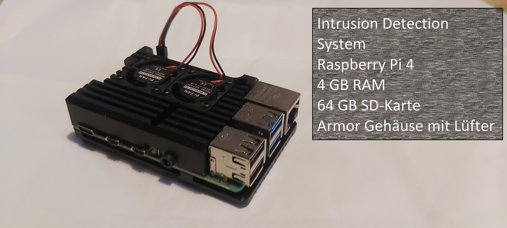
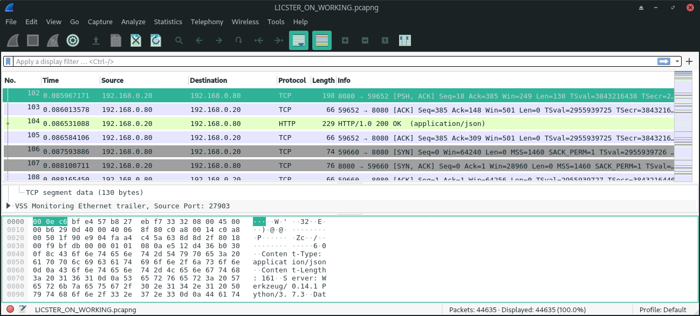
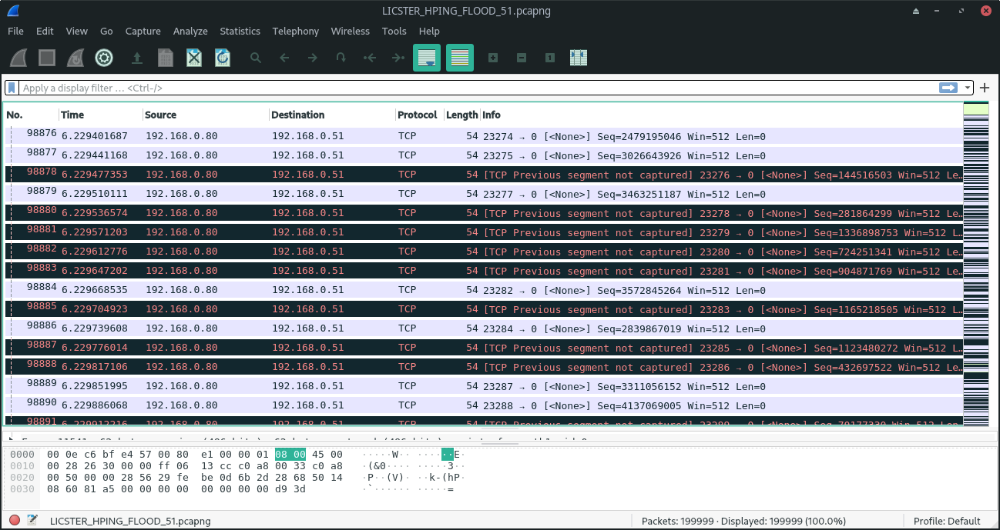

Intrusion Detection System
##########################

.. Michael Janzer, Eric Hoffmann, Janis Schickram

In unserer heutigen Zeit nehmen Angriffe auf industriele Systeme stetig weiter zu.
Immer wieder werden neue arten gefunden wie ein System angegriffen werden kann.
Dementsprechend gibt es auch schon sehr viele verschieden Tools die dafür da sind um
zu erkennenden wenn ein Angriff oder ein exploit auf einem System ausgeführt wird und
diesen dann auch dementsprechend zu stoppen:  Software wie Firewalls verhindern dass
nicht autorisierter Datenverkehr in das Netzwerk gelangt, Spam-Filter um unerwünschte
E-Mail-Nachrichten zu verhindern und Antiware-Tools zum Schutz von Endpunkten vor Malware.
All diese Tools werden in so gut wie jedem Unternehmen eingesetzt egal welche Branche
oder wie groß es ist. Ein weiteres wertvolles Sicherheitstool was ebenfalls eingesetzt
wird ist ein Netzwerk-IDS (Intrusion Detection-System). Um dieses geht es auch in unserem
Teil Projekt, bei dem wir ein solches System in dem Testbed LICSTER implementiert haben.

Unser Team
**********

Unser Team für das Teilprojekt „Intrusion Detection System“ (IDS) besteht aus den Projektmitgliedern Eric Hoffmann, Michael Janzer und Janis Schickram, die auch schon in ihrem Studium einen starken Fokus auf IT-Sicherheit gelegt haben. Wir haben zusammen mehrerer Kurse in Richtung IT-Sicherheit besucht und teilen uns die Faszination Systeme sicherer machen zu wollen. Deswegen wurde schnell klar, dass unser Team einen großen Wert auf den Sicherheitsaspekt von LICSTER legen wird.
Die Sicherheitslage von Industriesystemen auf der ganzen Welt wird immer kritischer(siehe :numref:`cyberattacken`). Bei Angriffen auf diese Systeme können in kürzester Zeit große wirtschaftliche Schäden erzielt werden.  

.. _cyberattacken:

    Cyberattacken auf deutsche Unternehmen im Jahre 2015
    | Quelle: https://de.statista.com/statistik/daten/studie/348989/umfrage/haeufigkeit-von-cyberattacken-auf-unternehmen/

Deswegen haben wir uns zur Aufgabe gemacht, LICSTER eine weitere Sicherheitsschicht hinzuzufügen. Schnell wurde klar, dass ein IDS eine schnelle und aufwandseffiziente Lösung für unsere Problemstellung ist. Ein IDS kann in ein bestehendes System eingebaut werden, ohne dass direkte Änderungen am System gemacht werden müssen. Dies war uns besonders wichtig, da LICSTER bereits vor unserem Projekt schon fertiggestellt war und wir keine konzeptuelle Änderung mehr nachträglich realisieren wollten. Ein bestehendes IDS zu Nutzen hat es uns ermöglicht den zeitlichen Rahmen des Projekts einzuhalten und nützliche Fähigkeiten für unser weiteres Studium zu erlernen.

Einrichtung Pi
**************

Für die Realisierung des IDS wurde sich für ein Raspberry Pi 4 entschieden. Mit 4 GB RAM - in der ausgewälten Konfiguration - ist das Pi geeignet Snort als IDS zu verwenden. Als Betriebssystem wird das Raspberry Pi OS (früher Raspbian genannt) genutzt, welches von der offiziellen Seite bezogen wurde (https://www.raspberrypi.org/downloads/). Dies wurde mit einem Image-Tool auf eine SD-Karte gespielt und über SSH wurden dann die restlichen Einrichtungen vorgenommen. Nachdem alles eingerichtet war (siehe :numref:`ids_raspberry`), konnte das Pi in das LICSTER Netzwerk eingesetzt werden. Das Pi wurde an den Mirrorport des Switchs angeschlossen, damit der gesamte Traffic des LICSTERs am Pi empfangen werden kann. Um durch den Dauerbetrieb entstehende Abwärme entgegenzuwirken wurde eine Hülle mit Lüftern für das Pi angeschafft. Im Home-Verzeichnis wurde das Git aus GitLab gecloned. Dieses Repository enthält die Configs und Rules für Snort, sowie weitere Skripte für das IDS.

.. _ids_raspberry:

    Unser IDS-Raspberry
    | Quelle: Eigene Darstellung

Einrichtung VM
**************

Aus Kostengründen konnte nicht für jedes der drei Mitglieder ein Raspberry Pi gekauft werden. Dieses Problem wurde mit Virtuellen Maschinen gelöst. Virtuelle Maschinen emulieren Hardware als Software auf einem Hostsystem. Als Virtualisierungssoftware wurde VirtualBox verwendet welches ein Image des Raspberry Pi Desktops nutzte. Somit konnte jedes Mitglied seine eigenes Raspberry Pi simulieren und jede Aufgabe konnte von Jedem erledigt werden. Bei der Einrichtung des Betriebssystems musste auf die bautechnischen Beschränkungen des Raspberry Pi 4 geachtet werden. Somit musste in der VM der Hauptspeicher auf 4 GB RAM beschränkt und der Festplattenspeicher musste auf die 64 GB der eingebauten SD-Karte begrenzt werden.

Was ist ein IDS
***************

„Ein IDS (Intrusion Detection System) ist ein Gerät oder eine Anwendung,
mit der der gesamte Netzwerkverkehr überprüft und der Benutzer oder Administrator
benachrichtigt wird, wenn nicht autorisierte Versuche oder Zugriffe stattgefunden haben.“ (Bradley, T., 2014. IDS. [online] verfügbar unter: https://techspective.net/2014/03/08/ids/ [Besucht 12 July 2020].)
Im Gegensatz dazu steht die Firewall, welche meist als Gatekeeper fungiert und somit nur den
Netzwerkverkehr überwacht und regelt. Das IDS konzentriert sich
auf den Traffic, der im internen Netzwerk abläuft. Dabei wird anhand von
verschieden Rulesets entschieden, ob der Traffic verdächtig ist bzw. er sich ungewöhnlich
verhält. Beispielhaft hierzu wäre es, wenn ein plötzlicher Anstieg des Traffic im Netzwerk erkannt wird.
Durch diese Weise kann ein IDS Angriffe erkennen welche an der Firewall
vorbei kommen oder aus dem eigenem Netzwerk stammen.

Wieso man es braucht
********************

Keine Firewall ist fehlerfrei und kein Netzwerk ist undurchdringlich. Angreifer
entwickeln ständig neue Exploits und Angriffstechniken, um auf ein System zu kommen.
Was von vielen Angreifern zusätzlich gerne genutzt wird ist Social Engineering oder
andere arten von Malware. Über diese Methoden gelangen sie meist an Benutzeranmeldeinformationen
und dadurch haben sie nun einen berechtigten zugriff auf das Netzwerk ohne das die
Firewall dies als böswilligen angriff sieht. Ein Network Intrusion Detection System kann
dagegen immer noch sehe was die Person auf dem System macht und falls dabei nun versucht
wird das irgendwelche angriffe ausgeführt werden diese auch erkennen und den System
Administrator zu benachrichtigen das dort was im System nicht stimmt.

Der Haupt Zweck eines ids systems besteht somit darin das It-Personal zu benachrichtigen
falls es einen Angriff oder andere Arten von Bad traffic gefunden hat. Die Kunst für das
Personal besteht nun darin zu schauen welche nachrichtig stimmen und welche ein false
positiv sind.

Arten von IDS
*************

Im Grundlegen werden zwischen zwei Arten von ids Systemen unterschieden nämlich der signature-based detection
und der anomaly-based detection.

Signature-based detection
=========================

Bei dieser Methode werden feste Muster verwendet, um den traffic zu kontrollieren.
Diese Muster beschreiben verdächtige Sammlung von Abfolgen von Aktivitäten oder
Operationen, die möglicherweise schädlich sein können. Diese werden dann meist in einer
Datenbank gespeichert. Es werden somit genau definierte Angriffsmuster verwendet,
die die Schwachstelen im System ausnutzten. Die Zeit, die somit gebraucht wird, um den
traffic zu vergleichen ist minimal. Der Hauptvorteil besteht somit darin das Muster oder
Signaturen das Netzwerkverhalten leicht verstehen zu können. Es ist somit effizienter
Angriffe zu verarbeiten die schon bekannt sind.

Die Hauptbeschränkung dieses Systems ist dadurch das Reagieren und Erkennen von Angriffen,
die nicht in der Datenbank gespeichert sind. Somit kann dieses System leicht getäuscht
werden das es nur mit einem bestimmten Satz von ausdrücken oder mit Zeichenfolgenübereinstimmung
arbeiten. Desweitern tuen sich solches System sehr schwer mit Angriffen bei denen
Menschen aktiv etwas tun.

Anomaly-based detection
=======================

Bei diesem System ist das Netzwerkverhalten der Haupt Parameter. Deshalb wird vorerst ein
Model erstellt, welches zeigt wie der normale traffic im Netzwerk aussehen soll.
Dieser kann entweder vorbestimmt werden oder durch vom Netzwerkadministrator festgelegte
Spezifikationen oder Bedingungen mit machine learning gelernt werden. Wenn das
Netzwerkverhalten innerhalb des Models liegt passt alles falls nicht wir eine Wahrung
vom Anomaly detection system ausgelöst.

Das Definieren der Regelsätze ist einer der Hauptnachteile des Anomaly detection systems.
Die Effizienz des Systems hängt von der effektiven Implementierung und dem Testen von
Regelsätzen für alle Protokolle ab. Darüber hinaus wirken sich verschiedene Protokolle
verschieden stark auf das System aus. Des Weiteren hat das System Probleme dabei wen das
böswillige Verhalten unter das akzeptierende Verhalten fällt.

Wireshark
*********

Um einen Überblick über die Pakete, die im LICSTER Netzwerk unterwegs sind, zu
bekommen, haben wir, mit Wireshark, den Netzwerkverkehr aufgezeichnet.

Als erstes haben wir pcaps während dem Einschalten, Betrieb und Abschalten von dem Testbed, mithilfe des Mirror Ports erstellt,
um zu sehen was während einem Regulären betrieb auf dem Netzwerk passiert (siehe :numref:`wireshark_normal`).

.. _wireshark_normal:

    Wireshark pcap vom LICSTER-Testbed während einem Leerlauf
    | Quelle: Eigene Darstellung

Als nächstes haben wir pcaps von Angriffen, die wir Durchgeführt haben, aufgezeichnet, um Regeln für unser Intrusion-Detection-System entwickeln zu können (siehe :numref:`wireshark_flood`).

.. _wireshark_flood:

    Wireshark pcap vom LICSTER-Testbed während einem Denial of Service Angriffs
    | Quelle: Eigene Darstellung

Durchgeführte Angriffe
======================

Die Skripte für die Angriffe sind im Offiziellen Github Repository zu finden (https://github.com/hsainnos/LICSTER/tree/master/attacks).

Flooding
--------

Flooding ist eine einfache und beliebte Art eines Denial-of-Service Angriffs.
Für den Angriff haben wir hping3 benutzt. Ein Einfaches CLI-tool um Pakete zu versenden.

Hier wird eins der beiden RemoteIO's vom LICSTER Testbed geflutet.

.. code-block::

    $ sudo hping3 --flood 192.168.0.51

Angriff auf das Fließband
-------------------------

Hier haben wir mit einem kleinen Python-Skript das Fließband vom LICSTER Testbed angegriffen und zum stoppen gebracht.
Ausgeführt wird er mit:

.. code-block::

    $ sudo ./conveyer_belt.py 

Angriff auf die manuelle Kontrolle
----------------------------------

Hier wird, mit einem Python-Skript, die manuelle Kontrolle vom LICSTER Testbed übernommen.
Ausgeführt wird er mit:

.. code-block::

      $ python3 -i client.py
      >>>

Anschließend kann man dann Befehle senden um das Testbed zu steuern.

Snort
*****

Snort ist eine Open-Source-Software für NIDS (Network Intrusion Detection System) und NIPS (Network Intrusion Prevention System). Veröffentlicht wurde sie 1998 von der Firma Sourcefire.

Wieso Snort?
============
Es wurde sich für Snort entschieden, da es schon seit längerem auf dem Markt verfügbar ist. Dank dieser Zeit ist Snort sehr ausgereift und auch weit verbreitet. Es ist kostenlos und durch seine große Community ist es leicht bei Problemen Unterstützung zu bekommen. Ein weiterer Punkt, warum sich für Snort entschieden wurde, ist, dass bereits einige Gruppenmitglieder sich ein wenig mit den Regeln auskannten. Die Syntax der Regeln ist leicht zu verstehen, bieten aber dennoch die nötige Komplexität, um aussagekräftige Meldungen zu bekommen.

Snort Einrichtung
=================

Als Erstes hat jedes Gruppenmitglied Snort bei seiner eigenen VM eingerichtet. So konnten schon die ersten Erfahrungen mit den Regeln und der Funktion von Snort gesammelt werden. Dann wurde abgewogen, welche Snort Version am geeignetsten für das Vorhaben ist. Zur Auswahl standen v2 und v3. Die neuere Version v3 besitzt neue Funktionen, aber dies kommt auch mit Performanceeinbußen einher. Da das Raspberry Pi 4 nur begrenzte Rechenleistung und Hauptspeicher besitzt, wurde sich für die ausgereiftere v2 entschieden. Snort wurde über apt install snort bezogen und war dann auch bereit für den Einsatz. Um die gleichen Konfigurationen und Regeln zu haben, wurde ein GitLab Repository eingerichtet welches alle Konfigurationsdateien und Regeln beinhaltet. Somit musste, um Snort zu starten, nur noch der Pfad zu der Konfiguration angegeben werden. Diese Konfigurationsdatei beinhaltete wiederrum die relativen Pfade zu den Regeln im Repository. Nach der Einrichtung sieht der Befehl zum Starten von Snort so aus: sudo snort -c /path/to/snort.conf

Snort Regeln
============

Damit Snort Angriffe/Abnormalitäten erkennen kann, müssen Regeln vorhanden sein, wonach Snort sich richten kann. Darauf Achten sollte man, dass man nicht zu viele Regeln implementiert, denn so kann es passieren, das Snort zu viele Alarme wirft, von denen viele  falsch sind und der echte Alarm untergeht (Man sieht den Angriff vor lauter "Angriffe" nicht mehr). Hat man aber zu wenige Regel implementiert, kann es passieren, dass mögliche Angriffe nicht erkannt werden. Es müssen also so wenig Regeln wie möglich, aber so viele wie nötig implementiert werden um Fehlalarme zu vermeiden und dennoch echte Angriffe erkennen zu können.

Regel schreiben
---------------

Damit man Regeln schreiben kann muss man erst verstehen wie eine Regel
aufgebaut ist. Hier Hilft die offizielle Anleitung
(http://manual-snort-org.s3-website-us-east-1.amazonaws.com/node27.html).

Hier in Kurzfassung:

Eine Regel besteht aus drei Teilen:

- Aktion
- Kopf
- Regeloptionen

Aktion
------

Hier wird angegeben was Snort tun soll, wenn es ein Paket findet, das den
Regel Kriterien entspricht. Es gibt 3 verfügbare Standardaktionen in Snort,
alert, log und pass. Wenn Snort im inline-modus ausgeführt wird, stehen drop,
reject und sdrop zur verfügung.

- ``'alert'`` erzeugt einen Alarm mit der gewählten Alarm Methode und protokolliert dann das Paket
- ``'log'`` das Paket protokollieren
- ``'pass'`` das Paket ignorieren
- ``'drop'`` das Paket blockieren und protokollieren
- ``'reject'`` das Paket blockieren, protokollieren und senden eines TCP-Reset, wenn das Protokoll TCP ist, oder eine ICMP-Port-Unerreichbarkeit Meldung, wenn das Protokoll UDP ist.
- ``'sdrop'`` das Paket blockieren, aber nicht protokollieren

Kopf
----

Dieses Feld steht für das Protokoll, die IP Adresse, die Ports und die
Richtungsanweisung.

**Protokolle**

Es gibt vier Protokolle, die Snort auf verdächtiges Verhalten analysiert: TCP,
UDP, ICMP und IP.

**IP Adressen und Ports**

Der nächste Teil des Regelkopfes befasst sich mit der IP-Adresse und den Port
für eine bestimmte Regel. Man kann das Heimnetzwerk in der Konfigurationsdatei
von Snort festlegen. Das Schlüsselwort any kann zur Definition einer beliebigen
Adresse verwendet werden.

Regeloptionen
-------------

Alle Regeloptionen werden durch das Semikolon (;) voneinander getrennt.
Es gibt vier Kategorien von Regeloptionen:

- general: enthält extra Informationen über die Regel, haben aber keine auswirkung während der Erkennung 
- payload: diese Optionen schauen in den Packet-Payload rein
- non-payload: diese Optionen schauen für nicht payload Daten
- post-detection: diese Optionen sind Regelspezifische trigger, die ausgeführt werden, nachdem eine Regel ausgelöst wird 

Mit diesen Kategoreien kann eine Regel beispielhaft aufgebaut werden (siehe :numref:`rules`).

.. _rules:
.. figure:: img/rules.png
    
    Aufbau einer Beispielregel
    | Quelle: Eigene Darstellung

Eine komplette Auflistung von Regeloptionen:
http://manual-snort-org.s3-website-us-east-1.amazonaws.com/node32.html

Unsere Snort Regeln
*******************

Um Snort noch effektiver zu gestalten, wurden eigene Regeln für LICSTER entworfen.

HTTP Regeln
===========

Mit HTTP Regeln wird der Traffic zwischen Webservern und Usern überwacht.

.. code-block::
  
   alert tcp !$HOME_NET any -> 192.168.0.10 $HTTP_PORTS (msg:"HTTP Get from EXTERNAL to 192.168.0.10"; \
   classtype: bad-unknown; content: "HTTP"; sid 1002000; rev: 1;)

Diese Regel ist dafür da, falls von einem Außenstehenden Netzwerk ein HTTP GET request empfangen worden ist.

.. code-block::
  
   alert tcp !192.168.20 any -> 192.168.30 $HTTP_PORTS (msg:"HTTP Get not from 192.168.0.20 to 192.168.0.30"; \
   classtype: bad-unknown; content: "HTTP"; sid 1002005; rev: 1;)

Hier ähnlich wie bei der vorherigen Regel, nur wird hier der Alarm geworfen, falls das GET request vom Heimnetz, aber nicht vom HMI, kommt.

ICMP Regel
==========

ICMP Regeln dienen zur Überwachung von Scans und DoS Attacken.

**Portscan**

.. code-block::
  
   alert icmp any any -> 192.168.0.10 any (msg:"Ping nmap Portscan 192.168.0.10"; \
   dsize:0; itype:8; classtype: network-scan; sid:1003000; rev:1;)

ICMP-Fehlermeldungen (Protocol/Port Unreachable) können verwendet werden, um die offenen Ports zu einer IP-Adresse herauszufinden.
Da die Paketgröße 0 ist wird hier ``'dsize'`` auf 0 gesetzt und der ``'itype'`` auf 8, da der Typ 8 für Echo Request steht.

**DoS**

.. code-block::
  
   alert icmp any any -> 192.168.0.10 any (msg:"Ping flood detected 192.168.0.10"; \
   itype:8; count 20, seconds 1; classtype: denial-of-service; sid:1003010; rev:1;)

Diese Regel ist für einen einfachen Ping flood Denial-of-Service Angriff. Ausgelöst wird die Regel, wenn
in einem Intervall von einer Sekunde, 20 Ping Pakete ankommen.

**DoS Teardrop**

.. code-block::
  
   alert icmp any any -> 192.168.0.10 any (msg:"ICMP Teardrop attack 192.168.0.10"; \
   fragbits:M; classtype: denial-of-service; sid:1003020;rev:1;)

Teardrop-Angriffe senden Fragmentierte Pakete die nicht wieder zusammengesetzt werden können, das zu einem DoS führen kann. Um den Angriff zu erkennen,
wird hier ``'fragbits'`` auf ``'M'`` für more gesetzt, was heißt dass noch mehr Pakete kommen.

**ICMP Router Discovery**

.. code-block::
  
   alert icmp any any -> 192.168.0.10 any (msg:"ICMP Router Discovery 192.168.0.10"; \
   icode:0; itype:9; classtype: network-scan; sid:1003030; rev:1;)

Ähnlich wie beim Portscan, nur werden hier nach Benachbarten Routern gesucht. ``'itype'`` wird auf 9 gesetzt da es für Router Advertisement steht.

**ICMP Too large packet**

.. code-block::
  
   alert icmp any any -> 192.168.0.10 any (msg:"Large ICMP Packet 192.168.0.10"; \
   dsize:>1500; classtype: denial-of-service; sid:1003040; rev:1;)

Diese Regel ist dafür da, falls zu große ICMP Pakete gesendet werden. ``'dsize'`` ist für die Paketgröße und wurde hier auf größer 1500 gesetzt.

Modbus Regel
============

Die Regeln für Modbus überwachen den Verkehr von RemoteIO und PLC.

**DoS**

.. code-block::
  
   alert tcp any any -> 192.168.0.51 502 (msg:"Modbus threshold violation 51"; threshold: \
   type both, track by_dst, count 60, seconds 1; classtype: successful-dos; sid:1001004;)

Diese Regel erkennt einen Denial-of-Service Angriff über das Modbus.

SSH Regel
=========

SSH Regeln dienen zur Zugriffskontrolle auf die einzelnen Komponenten.

**Strange Traffic**

.. code-block::
  
   alert tcp !$HOME_NET any -> 192.168.0.10 22 (msg:"SSH Request from EXTERNAL NET to 192.168.0.10"; \
   content:"SSH"; nocase; offset:0; depth:4; classtype: attempted-user; sid:1000101; rev:1;)

Diese Regel erkennt einen SSH Zugriffs versuch aus einem externen Netz.

**Brute Force**

.. code-block::
  
   alert tcp any any -> any 22 (msg:"SSH Brute Force Attempt"; flow:established, to_server; content:"SSH"; \
   nocase; offset:0; depth:4; detection_filter:track by_src, count 30, seconds 1; classtype: attempted-user; sid:1000201; rev:1;)

Diese Regel erkennt einen SSH Brute Force angriff.

**DoS**

.. code-block::
  
   alert tcp any any -> 192.168.0.10 22 (msg:"SSH DOS against 192.168.0.10"; \
   detection_filter:track by_src, count 50, seconds 1; classtype: denial-of-service; sid:1000301; rev:1;)

Diese Regeln erkennt einen SSH Denial-of-Service angriff.

.. code-block::
  
   alert tcp any any -> 192.168.0.10 22 (msg:"SSH DDOS against 192.168.0.10"; \
   detection_filter:track by_dst, count 500, seconds 1; classtype: denial-of-service; sid:1000306; rev:1;)

Gleich wie oben, nur ist diese Regel für das Erkennen eines Distributed-Denial-of-Service Angriffs zuständig. 

Fazit und Ausblick
******************

Durch die Implementierung eines Intrusion Detection Systems können wir jetzt den Netzwerkverkehr
überwachen sowie Angriffe und unberechtigte Zugriffe erkennen. Mit dem entwickeln von eigenen SSH, HTML, MODBUS
und ICMP Regeln, konnten wir Snort an das LICSTER-Testbed so anpassen, dass erkannt wird welches Gerät vom
LICSTER-Testbed angegriffen wird. So kann man direkt sehen welches Gerät unter Angriff steht und man kann direkt
dagegen vorgehen. Auch werden die Logs mittels einem Cronjob im Minutentakt mit SCP an die Webapplikation
versendet.

Nachdem jetzt das LICSTER-Testbed mit Snort überwacht wird, kann man zusätzlich noch weitere an das
LICSTER-Testbed angepasste Regeln entwickeln, um mehr LICSTER spezifische Angriffe zu erkennen. Ergänzend
kann man ein Intrusion Prevention System (IPS) implementieren. Ein IPS kann neben den Funktionen eines IDS,
wie das erkennen eines Angriffs auch aktiv Angriffe verhindern, indem es die jeweiligen Pakete im Netzwerkverkehr
dropped.
