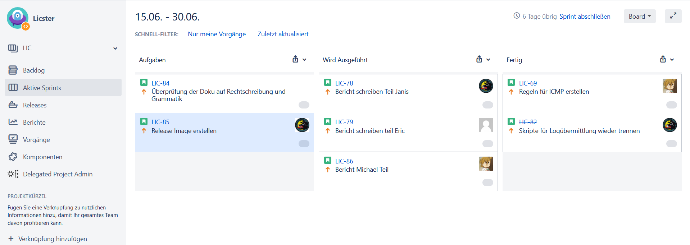

Workflow
########

Jedes Projekt sollte damit es erfolgreich wird einen einheitlichen Workflow besitzen.
Dieser dient zur Planung der Ressourcen und damit das Ziel vom Projekt nicht
verfehlt wird. Zur Kommunikation im Team nutzten wir verschiedene Technologien und
Vorgehensweisen, um eine möglichst gute kooperative Arbeitsweise zu ermöglichen.
Diese Strategien werden im Folgenden genauer erklärt.

Jitsi
*****
Um die Kommunikation mit dem Projektbetreuer herzustellen wurde das Tool Jitsi benutzt.
Der Vorteil dabei liegt darin das man sich keinen Account erstellen muss.
Somit wurde es ermöglicht, dass jeder leicht an den Meetings teilnehmen konnte.
Das Meeting mit dem Projektbetreuer war standartmäßig immer am Donnerstag um 17:30.

Discord
*******

Zur Besprechung und falls es Themen gibt, die mit dem Team besprochen werden mussten
wurde Discord genutzt. Dabei wurden mehrere Textkanäle und Sprachkanäle erstellt (siehe :numref:`discord`).
Bei den Textkanälen wurde drauf geachtet dass jeder Punkt
einen eigenen Kanal hat. Dies haben wir getan damit eine gute Übersicht gewährleistet
wird und man somit auch bei einem späteren Zeitpunkt die Informationen leicht nachschauen
kann die man braucht.

.. _discord:
.. figure:: img/Discord.png
    :alt:

    Kommunikationsverlauf bei Discord
    | Quelle: Eigene Darstellung

Jira
****

Für die zentrale Verwaltung der Aufgaben wurde das Tool Jira benutzt. Dabei wurde mit
dem Scrum Prinzip gearbeitet. In Scrum arbeitet man mit sogenannten Sprints. Diese
bestimmen einen Zeitraum, bei uns 1-2 Wochen, in der bestimmte Aufgaben erledigt
werden müssen. Die Arbeitsweise funktionierte so, dass man sich am Anfang einer jeden
Woche drauf geeinigt hat welche Aufgaben erledigt werden müssen diese wurden dann den
jeweiligen Personen zugewiesen. Ideen oder Aufgaben die für diese Woche noch nicht zu
bearbeiten sind oder noch nicht möglich sind zu bearbeiten wurden ins Backlog gesetzt.
Die Aufgaben könne dabei drei Zustände einnehmen: Aufgabe, wird ausgeführt und fertig.
Nachfolgend wird gezeigt wie dies in der Praxis aussieht (siehe :numref:`jira`).

.. _jira:

    Sprint vom 16.06 - 30.06
    | Quelle: Eigene Darstellung