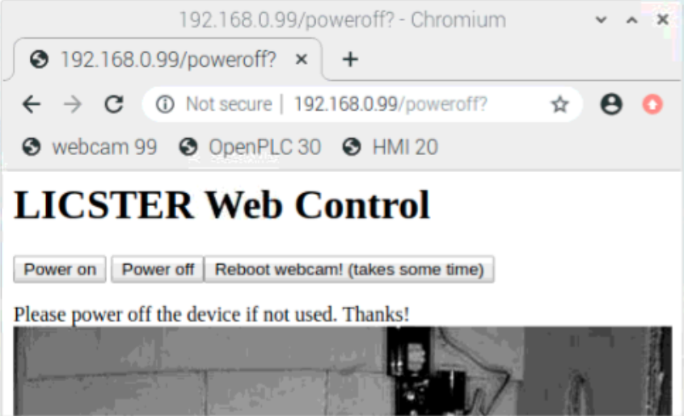

Probleme
########

Das Projekt LICSTER wurde 2020 etwas von der COVID-19 Pandemie beinträchtigt, da der physische Zugang zu dem LICSTER-Gerät anfangs nicht möglich war. Dies war der Grund wieso beschlossen wurde den Zugang über andere Wege zu realisieren.

Zugriff auf das LICSTER
=======================

   Screenshot von der Übergangslösung von Teamviewer und Custom Webseite

Der physische Zugriff auf das Testsystem welches beim Projektaufseher vor Ort installiert war, wurde durch Teamviewer und SSH ersetzt. Durch diesen Teamviewer Zugriff waren wir dann trotzdem in der Lage das Gerät ein- und auszuschalten und die Kamera zu rebooten.

Projekttag
==========

Der Projekttag war ebenfalls von der Pandemie beeinträchtigt jedoch war es uns möglich eine gemeinsame Präsentation über Microsoft Powerpoint online zu erstellen und diese auch an unseren Vortrag anzupassen.
